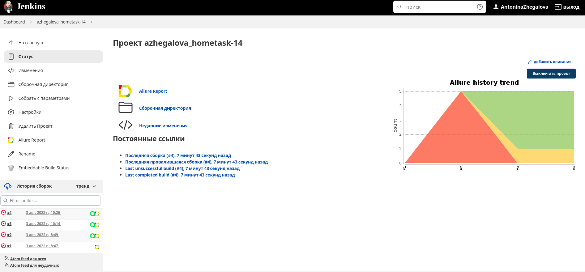
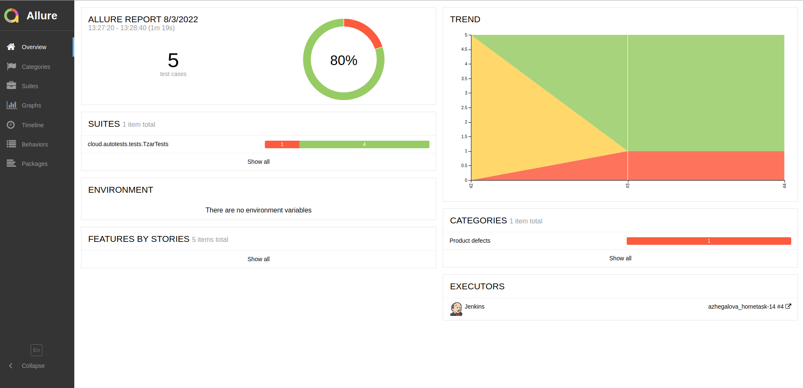
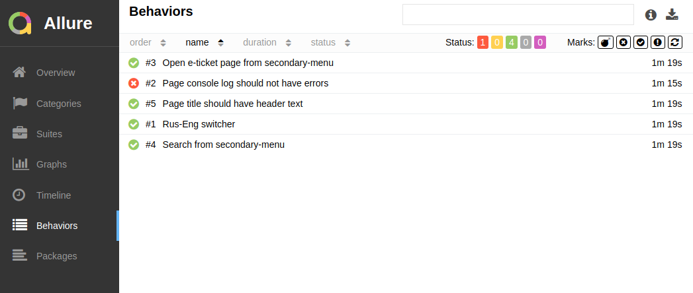
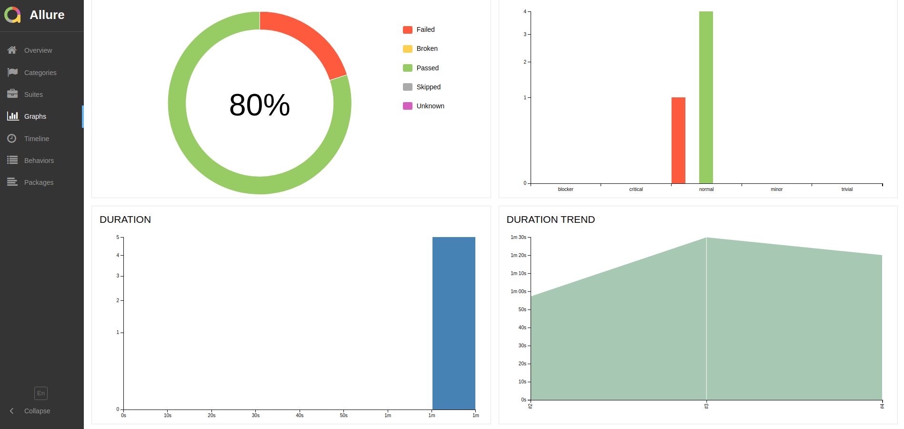
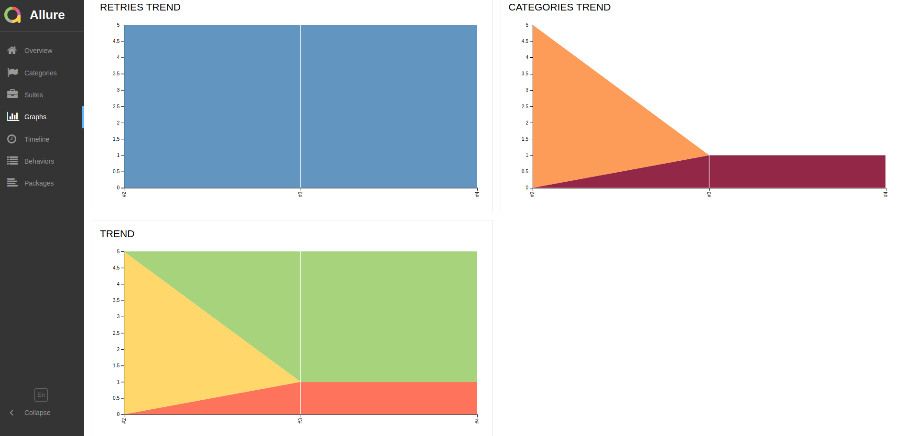
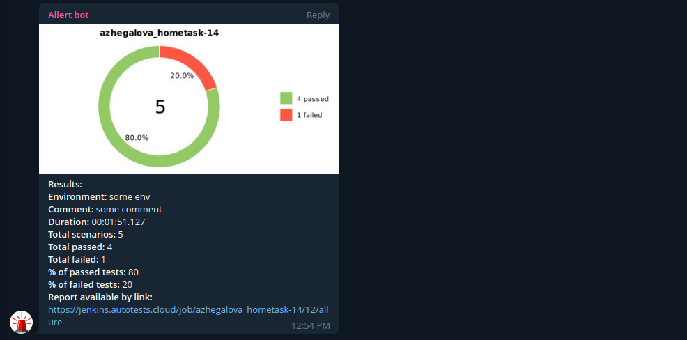

# Проект по автоматизации сайта Государственного музея заповедника "Царское село".


## 🚀 Содержание:

- [Технологии и инструменты](#earth_africa-технологии-и-инструменты)
- [Реализованные проверки](#earth_africa-Реализованные-проверки)
- [Сборка в Jenkins](#earth_africa-Jenkins-job)
- [Примеры запуска из терминала](#earth_africa-Запуск-тестов-из-терминала)
- [Примеры использования](#earth_africa-Allure-отчет)
- [Allure отчет](#earth_africa-Allure-отчет)
- [Отчет в Telegram](#earth_africa-Уведомление-в-Telegram-при-помощи-бота)
  
## 🧰 Технологии и инструменты:

<p align="center">
<a href="https://www.jetbrains.com/idea/"></a>
<a href="https://www.java.com/"></a>
<a href="https://github.com/"></a>
<a href="https://junit.org/junit5/"></a>
<a href="https://gradle.org/"></a>
<a href="https://selenide.org/"></a>
<a href="https://aerokube.com/selenoid/"></a>
<a href="https://github.com/allure-framework/allure2"></a>
<a href="https://www.jenkins.io/"></a>
</p>

## ⚓ Реализованные проверки:

Тест 1
- ✓ Открыть сайт https://tzar.ru/
- ✓ Поменять язык сайта на английский (ENG)
- ✓ Проверить, что заголовок страницы содержит текст: "Tsarskoe Selo State Museum and Heritage Site"

Тест 2
- ✓ Открыть сайт https://tzar.ru/
- ✓ Проверить, что заголовок страницы содержит текст: "Главная | Государственный музей-заповедник "Царское Село"

Тест 3
- ✓ Открыть сайт https://tzar.ru/
- ✓ Во вторичном меню (верхний правый угол) выбрать пункт "Билеты". Нажать.
- ✓ Нажат на кнопку "Купить билеты".
- ✓ Проверить, что текст страницы содержит текст: "Экскурсионное обслуживание предоставляется при формировании группы от 15 до 20 человек."

Тест 4
- ✓ Открыть сайт https://tzar.ru/
- ✓ Во вторичном меню (верхний правый угол) нажать на "лупу".
- ✓ В строке поиска ввести валидное значение "екатерининский дворец"
- ✓ Проверить, что заголовок страницы содержит текст: "Искать екатерининский дворец"

Тест 5
- ✓ Проверить, что журнал консоли не содержит ошибок типа 'SEVERE'


## </a> Jenkins <a target="_blank" href="https://jenkins.autotests.cloud/job/azhegalova_hometask-14/"> job </a>
<p align="center">
<a href="https://jenkins.autotests.cloud/job/azhegalova_hometask-14/"></a>
</p>


## 🧙 Параметры сборки в Jenkins для примера:

- Browser (браузер, по умолчанию chrome)
- Version (версия браузера, по умолчанию 100.0)
- Browser_size (размер окна браузера, по умолчанию 1920x1080)


## 🏗️ Команды для запуска тестов из терминала:
Локальный запуск:
```
gradle clean test
```

Удаленный запуск:
```
clean
test
-Dbrowser=${BROWSER}
-Dversion=${VERSION}
-Dsize=${BROWSER_SIZE}
-Durl=${REMOTE_URL}
```

# Примеры использования:

### Для запуска удаленных тестов необходимо заполнить remote.properties или передать значение. Например:

* browser (default chrome)
* browserVersion (default 100.0)
* browserSize (default 1920x1080)
* remoteDriverUrl (https://selenoid.autotests.cloud/)
* threads (5)


Запуск тестов с заполненным remote.properties:
```bash
gradle clean test
```

Запуск тестов с незаполненным remote.properties:
```bash
gradle clean -DremoteDriverUrl=https://%s:%s@selenoid.autotests.cloud/wd/hub/ -DvideoStorage=https://selenoid.autotests.cloud/video/ -Dthreads=1 test
```

Отчет:
```bash
allure serve build/allure-results
```
## </a> Отчет в <a target="_blank" href="https://jenkins.autotests.cloud/job/azhegalova_hometask-14/4/allure">Allure report</a>

## ⛅ Основной отчет:
<p align="center">

</p>

## 🧪 Тесты:
<p align="center">

</p>

## 💹 Графики:
<p align="center">

</p>
<p align="center">

</p>

## </a> Уведомление в Telegram при помощи бота: 

<p align="center">

</p>

## ⬇️ Примеры запуска тестов в Selenoid:
## </a> Видео 1 <a target="_blank" href="https://selenoid.autotests.cloud/video/e0d38be6e46b6161571bf42e890c2c7f.mp4">прохождения тестов </a>
<p align="center">
<a href="https://selenoid.autotests.cloud/video/e0d38be6e46b6161571bf42e890c2c7f.mp4"></a>
</p>

## </a> Видео 2 <a target="_blank" href="https://selenoid.autotests.cloud/video/9c771aff38bd9dbd13661d1fd759e4a2.mp4">прохождения тестов </a>
<p align="center">
<a href="https://selenoid.autotests.cloud/video/9c771aff38bd9dbd13661d1fd759e4a2.mp4"></a>
</p>
